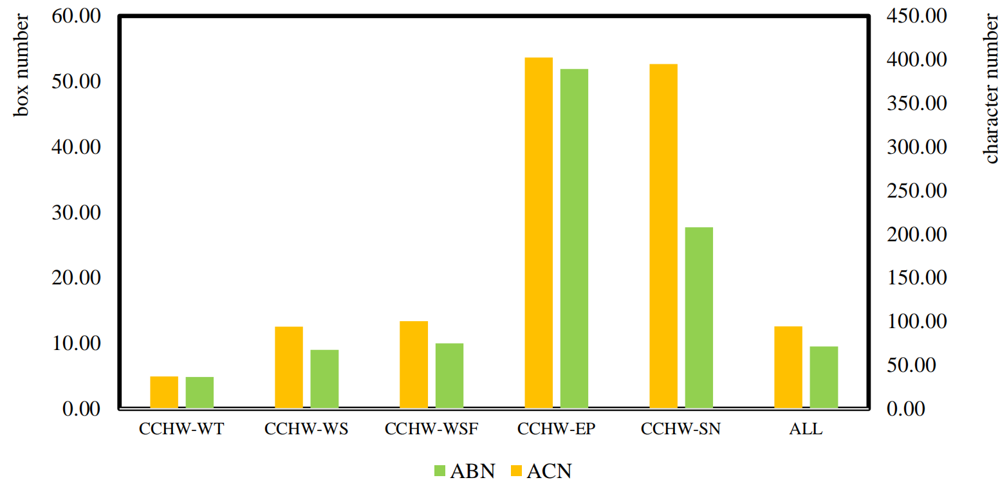
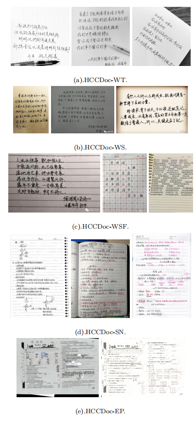
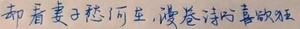
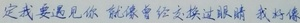
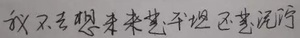
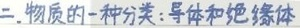
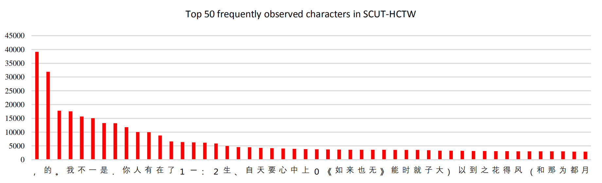

# SCUT-HCCDoc_Dataset_Release

The SCUT-HCCDoc Dataset for the research of offline handwritten Chinese text recognition (HCTR) in 
camera-captured document images is now released by Deep Leaning and Visual Computing Lab of South 
China University of Technology. The dataset can be downloaded through the following link:

- [Baidu Cloud](https://pan.baidu.com/s/12UMq-rELHBCt5a3FoSrnIg )  (Password : bwn5 , Size = 2.0GB)
- [OneDrive](https://1drv.ms/u/s!AkXauEAZ68NKoQnN4uoBAsofeNTw?e=iAZxOL) 

Note: The SCUT-HCCDoc dataset can only be used for non-commercial research purpose. 
For scholars or organization who wants to use the SCUT-EPT database, please first fill 
in this [Application Form](Application_Form/Application_Form_for_Using_SCUT-HCCDoc_2020.doc) 
and send it via email to us ([eelwjin@scut.edu.cn](mailto:eelwjin@scut.edu.cn)). 
When submiting the application form to us, please list or attached 1-2 of your 
publications in recent 6 years to indicate that you (or your team) do research 
in the related research fields of OCR, handwriting analysis and recognition, 
document image processing, intelligent education, and so on. We will give you the 
decompression password after your letter has been received and approved. 

## Description

The SCUT-HCCDoc Dataset contains 12,253 camera-captured natural images with 116,629 text lines
and 1,155,801 characters. According to different application scenes, SCUT-HCCDoc can be roughly
divided into five subsets: 
* HCCDoc-WT: images of traditional Chinese characters;
* HCCDoc-WS: images of simplified Chinese characters without a formatted background;
* HCCDoc-WSF: images of simplified Chinese characters with the formatted background;
* HCCDoc-SN: images of student notes;
* HCCDoc-EP: images of examination papers.

The sample distribution of five subsets is shown below:
  


The comparison of the five subsets of SCUT-HCCDoc in 
terms of the character number and text line box number (ABN is average box number; 
ACN is average character number) is shown below.
 


The following are some page/text level images of SCUT-HCCDoc:












The diversity of SCUT-HCCDoc can be described in three levels: 
1) **Image-level diversity:** image appearance and geometric variances
caused by camera-captured settings (such as perspective, background, and resolution) and 
different applications (such as note-taking, test papers, and homework); 
2) **Text-level diversity:** variances of text line length, rotation, etc.; 
3) **Character-level diversity:** variances of character categories (up to 6,109 classes 
with additional English letters, and digits), character size, individual writing style, etc.

For example, the following image shows the number of character instances for the 50 most frequently 
observed character categories in the SCUT-HCCDoc.




## Citation and Contact
Please consider to cite our paper when you use our dataset:
```
@article{zhang2020hccdoc,
  author    = {Zhang, Hesuo and Liang, Lingyu and Jin, Lianwen},
  title     = {SCUT-HCCDoc: A New Benchmark Dataset of Handwritten Chinese Text in Unconstrained Camera-captured Documents},
  journal   = {Pattern Recognition},
  year      = {2020},
  publisher = {Elsevier}
}
```
For any quetions about the dataset please contact the authors by sending email to Hesuo Zhang 
([eehesuo.zhang@mail.scut.edu.cn](mailto:eehesuo.zhang@mail.scut.edu.cn)), Lingyu Liang
([lianglysky@gmail.com](mailto:lianglysky@gmail.com)) or Prof. Jin
([eelwjin@scut.edu.cn](mailto:eelwjin@scut.edu.cn)).

## Acknowledgment
This research is supported in part by National Nature Science 
Foundation of China (No.61936003, No.61872151),  Natural 
Science Foundation of Guangdong Province (No.2017A030312006, 
No.2019A1515011045), the National Key Research and Development 
Program of China (No. 2016YFB1001405), and Fundamental Research 
Funds for the Central Universities (x2dxD2190570, 2019MS023).

