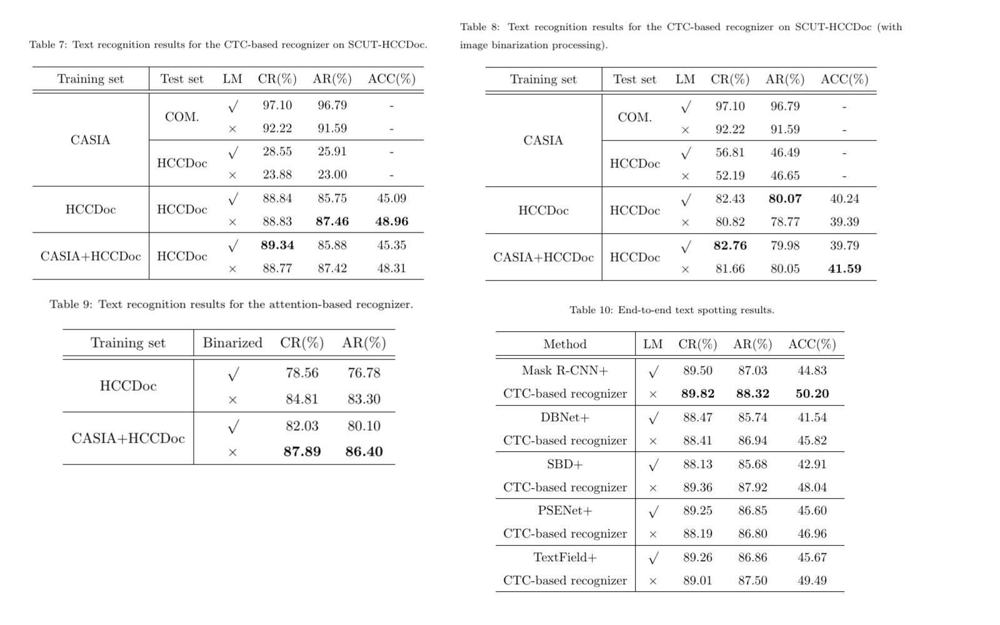

# SCUT-HCCDoc_Dataset_Release

The SCUT-HCCDoc Dataset for the research of offline handwritten Chinese text recognition (HCTR) in camera-captured document images is now released by Deep Leaning and Visual Computing Lab of South China University of Technology. The dataset can be downloaded through the following link:

- [Baidu Cloud](https://pan.baidu.com/s/1xxgt3olnC3nh4-nf7K9Nvg)  (Password: dlvc, Size=2G)
- [OneDrive](https://1drv.ms/u/s!AkXauEAZ68NKoQoaUccK7MjVetNq?e=RcQD8t) 


Note: The SCUT-HCCDoc dataset can only be used for non-commercial research purpose. For scholars or organization who wants to use the SCUT-HCCDoc database, please first fill in this [Application Form](Application_Form/Application_Form_for_Using_SCUT-HCCDoc_2020.doc) and send it via email to us ([eelwjin@scut.edu.cn](mailto:eelwjin@scut.edu.cn)). When submiting the application form to us, please list or attached 1-2 of your publications in recent 6 years to indicate that you (or your team) do research in the related research fields of OCR, handwriting analysis and recognition, document image processing, and so on. We will give you the decompression password after your letter has been received and approved. 

Please be noted that from December 2022, we are no longer accepting free use requests from companies. If a company applicant would like to use the dataset, please contact Dr. Jin ([eelwjin@scut.edu.cn](mailto:eelwjin@scut.edu.cn)) to apply for commercial purposes usage.

## Description

The SCUT-HCCDoc Dataset contains 12,253 camera-captured natural images with 116,629 text lines
and 1,155,801 characters. According to different application scenes, SCUT-HCCDoc can be roughly
divided into five subsets: 
* HCCDoc-WT: images of traditional Chinese characters;
* HCCDoc-WS: images of simplified Chinese characters without a formatted background;
* HCCDoc-WSF: images of simplified Chinese characters with the formatted background;
* HCCDoc-SN: images of student notes;
* HCCDoc-EP: images of examination papers.

The sample distribution of five subsets is shown below:
  


The comparison of the five subsets of SCUT-HCCDoc in 
terms of the character number and text line box number (ABN is average box number; 
ACN is average character number) is shown below.
 


The following are some page/text level images of SCUT-HCCDoc:


The diversity of SCUT-HCCDoc can be described in three levels: 
1) **Image-level diversity:** image appearance and geometric variances caused by camera-captured settings (such as perspective, background, and resolution) and  different applications (such as note-taking, test papers, and homework); 
2) **Text-level diversity:** variances of text line length, rotation, etc.; 
3) **Character-level diversity:** variances of character categories (up to 6,109 classes with additional English letters, and digits), character size, individual writing style, etc.

For example, the following image shows the number of character instances for the 50 most frequently observed character categories in the SCUT-HCCDoc.


## Text recognition baseline (updated)

Here, we give the **latest baseline results**, which are different from those in the paper. In the paper, the input images of the recognizers are resize to 576 x 126 directly. However, we found that it is appropriate, because it will cause huge  deformations in the long text images. So when training, we keep the aspect ratio of input image, and pad the image with zero pixels to a size of 2304 x 126. The network structure and  other training parameter settings are unchanged. The experiments have shown that it does lead to significant improvements, as shown in the tables below.



## Citation and Contact
Please consider to cite our paper when you use our dataset:
```
@article{zhang2020scut,
  title={SCUT-HCCDoc: A New Benchmark Dataset of Handwritten Chinese Text in Unconstrained Camera-captured Documents},
  author={Zhang, Hesuo and Liang, Lingyu and Jin, Lianwen},
  journal={Pattern Recognition},
  pages={107559},
  year={2020},
  publisher={Elsevier}
}
```
For any quetions about the dataset please contact the authors by sending email to Prof. Jin
([eelwjin@scut.edu.cn](mailto:eelwjin@scut.edu.cn)). 

## Statement
Many images of SCUT-HCCDoc are searched and downloaded from the Internet, we do not own the copyright of the images. For researchers and developers who wish to use the images for non-commercial research and/or education purpose, we provide the access to images and the corresponding annotations.The url of the web images are given in the dataset. 

If you believe that any images or text in SCUT-HCCDoc violated your rights, please let us know, and we will remove the images.
